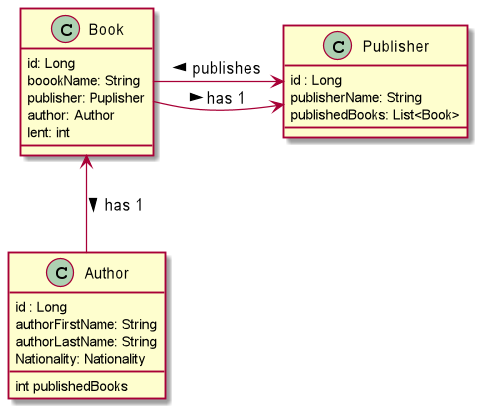
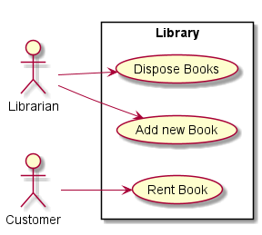

# library project

The goal of this micro project is to simulate a library.

UseCase Descriptions:
* Register new Author: This usecase describes that the 
Librarian can register a new Author in the Database
 of the Library.

* Add new Book: This usecase describes that a new Book 
can be added to the storage of the libary.

* Rent Book: This usecase describes that a Book is lent to
a customer of the Library.